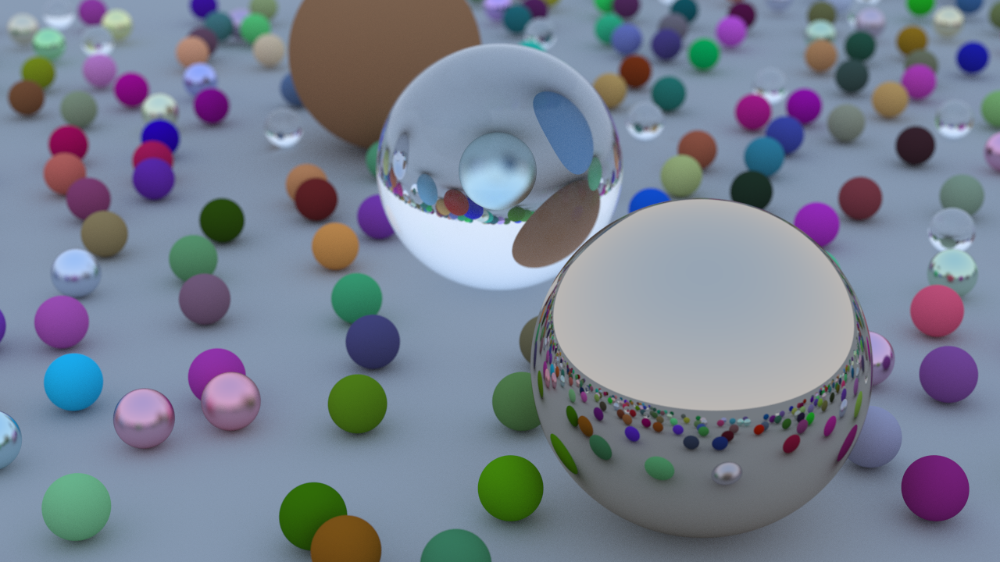

# Playing with [_Ray Tracing in One Weekend_](https://raytracing.github.io/books/RayTracingInOneWeekend.html)

- for web browsers
- `display-p3` with `<canvas>`
- `Worker`s
- TypeScript (and Deno)

## Next Steps

- Document what isn't documented
- Experiment with `oklch`?
